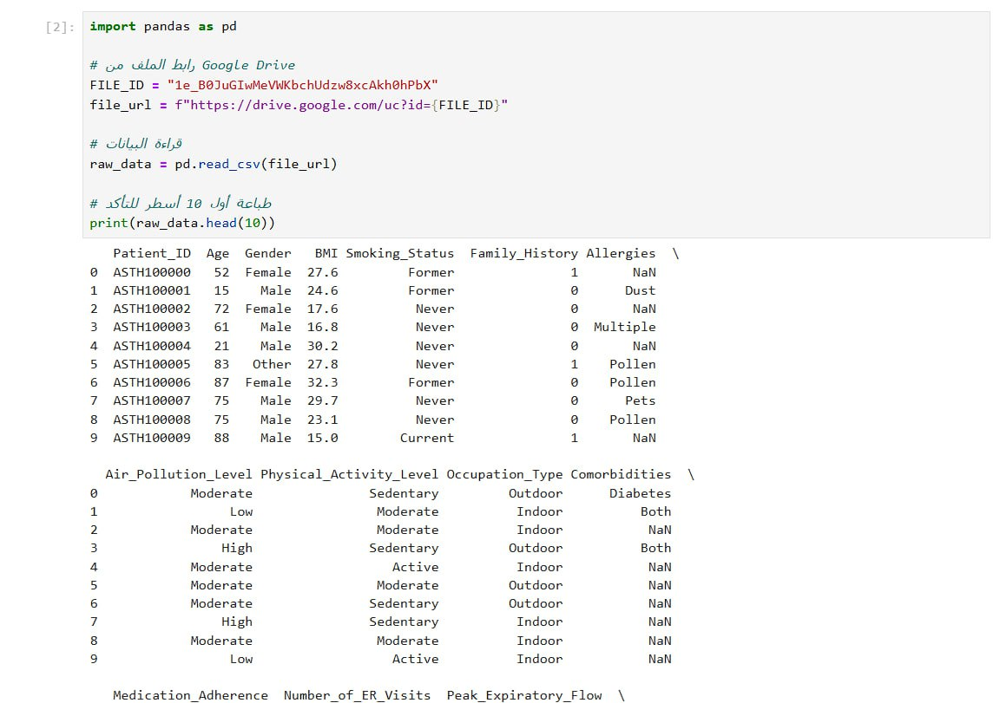

# Asthma Risk & Severity Dataset

   ### [About Dataset](https://drive.google.com/file/d/1e_B0JuGIwMeVWKbchUdzw8xcAkh0hPbX/view?usp=drive_link)
   This synthetic dataset simulates health records of individuals with varying levels of asthma severity. It is designed to support predictive modeling, classification, and exploratory analysis in the healthcare domain.

The dataset contains patient-level data such as demographics, lifestyle factors, environmental exposures, and medical indicators that are known to influence asthma risk and severity.

Use cases include:

- [Asthma severity prediction]
- [Health risk scoring]
- [Impact analysis of factors like pollution, BMI, or smoking]
- [Educational machine learning tasks]

Since the data is fully synthetic, it is safe for public use and contains no personal or sensitive information.
## скрипт выгрузки файла из Google Drive 

     import pandas as pd

     FILE_ID = "1e_B0JuGIwMeVWKbchUdzw8xcAkh0hPbX"  # ID файла на Google Drive
     file_url = f"https://drive.google.com/uc?id={FILE_ID}"

      raw_data = pd.read_csv(file_url)     # читаем файл

      raw_data.head(10) 
     print(raw_data.head(10))
     

## Зависимости 
    pandas
    matplotlib
    jupyterlab
    gdown
    wget
    ipykernel
