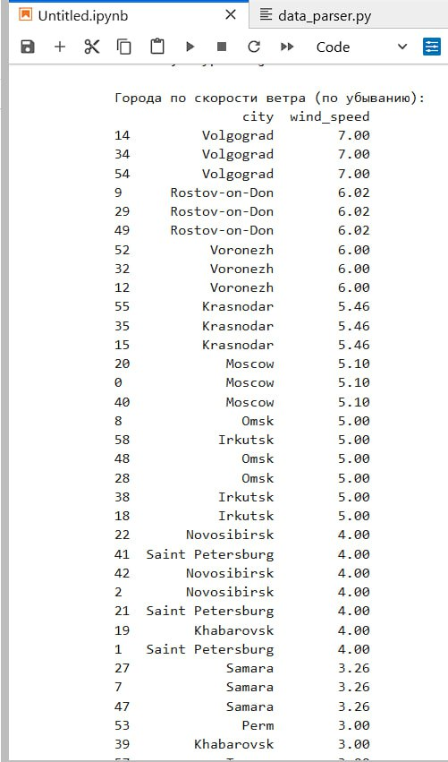
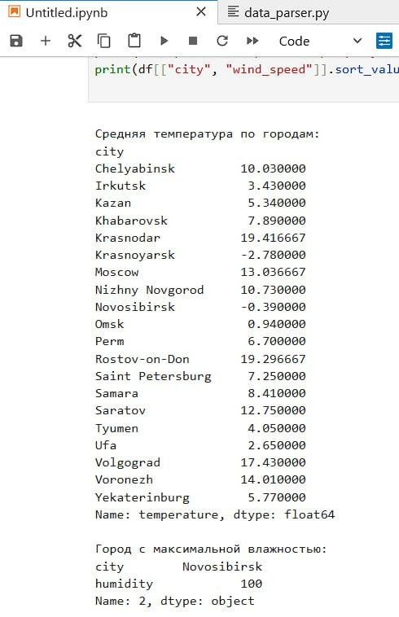

# Parse Example: Анализ данных о погоде

## Описание
Скрипт data_parser.py выполняет простой анализ данных о погоде, собранных для городов России.  
CSV файл (russia_weather_multiple.csv) не хранится в репозитории, используется локально из папки api_example.

Скрипт анализирует данные и выводит:
- Среднюю температуру по каждому городу  
- Город с максимальной влажностью  
- Города, отсортированные по скорости ветра

.
## Код скрипта

```python
import pandas as pd

# 📄 Чтение CSV файла, собранного в первой части
df = pd.read_csv("api_example/russia_weather_multiple.csv")

# 🌡 Средняя температура по каждому городу
print("\nСредняя температура по городам:")
print(df.groupby("city")["temperature"].mean())

# 💧 Город с максимальной влажностью
max_humidity = df.loc[df["humidity"].idxmax()]
print("\nГород с максимальной влажностью:")
print(max_humidity[["city", "humidity"]])

# 🌬 Города, отсортированные по скорости ветра (по убыванию)
print("\nГорода по скорости ветра (по убыванию):")
print(df[["city", "wind_speed"]].sort_values(by="wind_speed", ascending=False))
